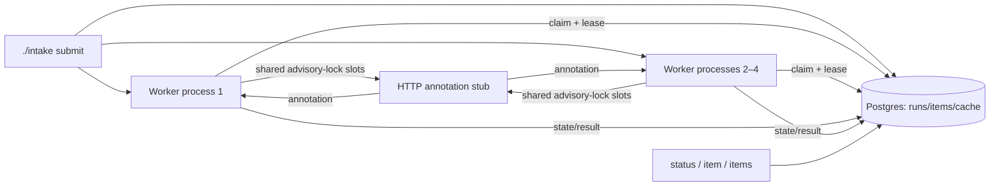

# Architecture

`./intake up` starts Postgres, the single-process stub, and detached worker OS processes. Workers atomically lease one pending item from Postgres. A heartbeat extends a live lease; after a SIGKILL, another worker can claim it once the lease expires. Two Postgres advisory locks enforce the stub's shared capacity of two across workers.

Each worker reads raw bytes, hashes them, extracts declared-type text where applicable, then checks the tenant-scoped cache. Pre-annotation failures become terminal without an HTTP call. Annotation attempts are recorded before the HTTP boundary so billed-call evidence remains durable if a worker is killed.

Local fidelity: this reproduces independent processes, durable recovery, capacity limiting, latency, scheduled server failures, and billing at an HTTP boundary. It does not exercise multi-host networking, Postgres failover, authentication, or a real annotation model.
